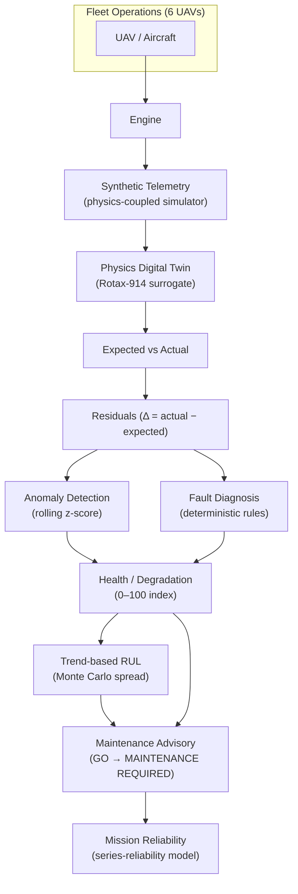
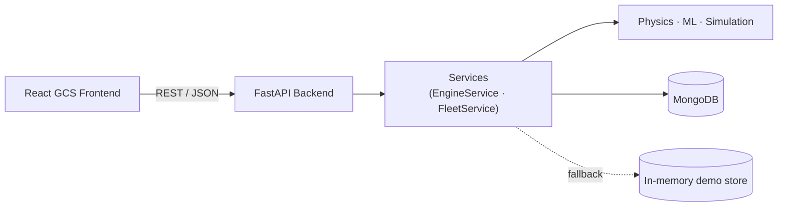

# VajraTwin

### AI-Enabled Real-Time Digital Twin for UAV Aero-Piston Engine Health Monitoring, Fault Prediction & Mission Reliability


VajraTwin is a **demonstrator-grade digital twin** for a MALE-UAV-class aero-piston engine (calibrated conceptually on the Rotax 914 F/UL). It generates physics-coupled **synthetic** engine telemetry, runs a lightweight **physics surrogate** of the engine to compute expected behaviour, derives **residuals** (actual − expected), and turns those residuals into actionable engine health information through a deterministic pipeline: anomaly detection → fault diagnosis → health/degradation tracking → trend-based Remaining Useful Life (RUL) → maintenance advisory → mission reliability. A **Fleet Operations** layer scales the same engine twin across six demonstrator UAVs. It is local-first, requires no cloud services, and runs with MongoDB **or** an automatic in-memory demo fallback.

> **SIH 2026 · Problem Statement PS26054 · Robotics & Drones (Software)**

---

## Overview

A UAV has no onboard pilot to feel vibration, hear a misfire, or smell a rich mixture. Raw telemetry tells you *what the sensors read*, but not *whether that reading is normal for the current operating point*. VajraTwin closes that gap.

The platform provides:

- **Synthetic telemetry** — a physics-coupled simulator produces realistic, correlated engine signals (RPM, MAP, EGT, CHT, oil temperature, oil pressure, fuel flow, vibration) across mission phases, with injectable fault scenarios.
- **Physics digital twin** — an algebraic Rotax-914-class surrogate (volumetric efficiency, speed-density mass airflow, turbo/intercooler inlet temperature, lumped thermal dynamics) computes the *expected* value of every channel.
- **Expected-vs-actual residuals** — Δ = actual − expected for each channel, the core health signal.
- **Deterministic diagnostics** — statistical anomaly scoring + rule-based fault classification (reproducible and explainable, not a black box).
- **Health / degradation tracking** — a smoothed 0–100 health index with trend and rate.
- **Trend-based RUL** — a transparent degradation-trend projection with a Monte Carlo confidence band.
- **Maintenance advisory** — a four-state deterministic decision engine (GO / GO WITH MONITORING / GO WITH DERATE / MAINTENANCE REQUIRED).
- **Mission reliability** — a documented series-reliability model producing a completion probability, risk level and limiting factor.
- **Fleet operations** — six demonstrator UAVs, each backed by its own real engine twin, aggregated into a fleet view with maintenance prioritisation.

> **Data honesty.** All telemetry is **physics-coupled synthetic data** produced by the built-in simulator — not real UAV/DRDO operational telemetry. RUL is a **trend-based demonstrator estimate derived from synthetic degradation data**, not a certified engine-life prediction.

---

## Why VajraTwin

> Telemetry alone tells you **what happened**. VajraTwin compares observed behaviour against a **physics-informed expectation**, isolates the deviation, and translates it into engine- and mission-level decisions.

Concretely, the residual (Δ = actual − expected) is far more diagnostic than a raw sensor value: an EGT of 820 °C is meaningless out of context, but "EGT is +48 °C above the physics baseline at this RPM/MAP/load" is an actionable signal. Every downstream stage — anomaly, fault class, health, RUL, advisory, mission — is driven by these residuals, so the whole chain is physically grounded and explainable.

---

## System Architecture





MongoDB is **optional** in local demo mode: if it is unreachable, the backend automatically switches to an in-memory store and the UI shows **DEMO MODE**. The application never crashes due to a missing database.

---

## Digital Twin Pipeline

Each telemetry frame flows through nine stages (one `Analysis` object per frame):

| # | Stage | Module | What it does |
|---|-------|--------|--------------|
| 1 | **Telemetry generation** | `app/simulation/simulator.py` | Physics-coupled synthetic frame driven by a latent load demand + mission phase |
| 2 | **Physics surrogate** | `app/physics/engine.py` | `calculate_expected_parameters()` → healthy baseline for every channel |
| 3 | **Residual analysis** | `app/physics/engine.py` | `calculate_residuals()` → Δ = actual − expected |
| 4 | **Anomaly detection** | `app/ml/anomaly.py` | Rolling z-score over residuals → 0–100 score + contributing features |
| 5 | **Fault diagnosis** | `app/ml/fault_diagnosis.py` | Deterministic classification into one of 8 fault classes + evidence |
| 6 | **Health / degradation** | `app/ml/degradation.py` | Smoothed health index (0–100), trend and degradation rate |
| 7 | **RUL estimation** | `app/ml/rul.py` | Trend-based projection + Monte Carlo P5–P95 confidence band |
| 8 | **Maintenance advisory** | `app/ml/advisory.py` | Deterministic 4-state decision + root cause + recommended action |
| 9 | **Mission reliability** | `app/ml/mission.py` | Series-reliability product of five documented factors |

An optional **XAI explanation layer** (`app/ml/ai_provider.py`) produces a human-readable narrative. It is **deterministic by default** (no network, no key) and can optionally call an external LLM — but it **only explains** the already-decided state; it never changes the fault class or advisory.

### Fault classes

`NORMAL`, `EGT_ANOMALY`, `CHT_OVERHEAT`, `OIL_PRESSURE_LOW`, `VIBRATION_ANOMALY`, `BOOST_TURBO_ANOMALY`, `SENSOR_ANOMALY`, `MULTI_PARAMETER_FAULT`.

### Anomaly vs fault vs health (kept distinct on purpose)

| Concept | Meaning |
|---|---|
| **Anomaly score** | Statistical novelty of the residual vector (adapts over time) |
| **Fault class** | Diagnosed condition from deterministic rules |
| **Fault severity** | Severity of the diagnosed condition (0–1) |
| **Health index** | Overall engine condition (0–100) |

The anomaly score may relax under a *sustained* fault (the statistical detector adapts to the new baseline). This is expected: decisions are driven by **fault class · severity · health · RUL**, not by the raw anomaly score.

---

## Fleet Operations

The fleet layer (`app/services/fleet_service.py`) is a thin orchestration over the existing engine pipeline — it contains **no separate analytics engine**. Each of the six demonstrator UAVs (`UAV-001 … UAV-006`) is backed by its own real `EngineService` instance, so the fleet view and the per-engine view always report the **same underlying state**.

Capabilities:

- **Fleet health** — unweighted mean of per-engine health indices.
- **Per-aircraft state** — health, fault class, severity, RUL, advisory, scenario.
- **Status mapping** — advisory state → `HEALTHY` / `ATTENTION` / `CRITICAL` (reuses the existing advisory states, no second state machine).
- **Maintenance priority** — a transparent ranking by status → health → RUL → severity, each entry showing its reason.
- **Per-UAV scenario injection** and **per-UAV / whole-fleet reset** to a deterministic initial state.

The initial fleet distribution is produced by the **real diagnostic pipeline** (two aircraft are pre-armed with a mild fault scenario and warmed up), not by hardcoded health numbers.

---

## Demonstrator Scenarios

All scenario data is **SYNTHETIC**. The simulator supports nine scenarios (`app/simulation/scenarios/definitions.py`):

| Scenario | Signature |
|---|---|
| `HEALTHY` | Nominal operation within all envelopes |
| `HIGH_EGT` | Lean/ignition-retard: EGT above baseline |
| `HIGH_CHT` | Cooling degradation: CHT ↑, oil temp ↑, oil pressure ↓ |
| `LOW_OIL_PRESSURE` | Oil leak / pump wear: oil pressure ↓↓, oil temp ↑, vibration ↑ |
| `HIGH_VIBRATION` | Misfire / imbalance: vibration ↑↑, EGT ↓ |
| `TURBO_BOOST` | Wastegate / over-boost: MAP ↑, EGT ↑, CHT ↑ |
| `SENSOR_DRIFT` | EGT sensor bias with no corroborating change |
| `COMBINED_FAULT` | Cooling + oil + vibration simultaneously |
| `DEGRADING` | Progressive multi-parameter degradation over time |

**Verified behaviour (representative run, synthetic data).** Starting from a healthy baseline (health ~85+, fault `NORMAL`, advisory `GO`), injecting `HIGH_CHT` at high severity drives the chain: residuals cross their warn bands → anomaly rises → fault classified (`CHT_OVERHEAT` / `MULTI_PARAMETER_FAULT`) → health declines (observed ~87 → ~60) → trend-based RUL drops (observed ~order of 1 h) → advisory escalates to `MAINTENANCE REQUIRED` → mission completion probability falls and risk becomes `HIGH`. Resetting restores the deterministic healthy state. These numbers are illustrative synthetic outputs, not measured engine data.

---

## Key Engineering Design Decisions

- **Local-first, zero cloud.** No AWS/GCP/Azure dependency. Runs entirely on a laptop.
- **Deterministic diagnostics.** Fault class and advisory are rule-based and reproducible; the AI layer only explains and can never override a safety state.
- **Physics-coupled synthetic telemetry.** A single latent load demand drives all channels together, so the stream is physically plausible rather than independent noise.
- **MongoDB + in-memory fallback.** MongoDB is the primary store; any connection failure transparently switches to an in-memory store (**DEMO MODE**) so the demo never fails.
- **Centralized API client.** The frontend talks to the backend through a single typed client (`src/services/api.ts`), base URL from `VITE_API_BASE_URL`.
- **Fleet / engine separation.** The fleet service aggregates real engine state; it never duplicates the engine pipeline.
- **Reproducible simulation.** Deterministic seeding and scenario definitions make demos repeatable.

---

## Technology Stack

| Layer | Technology |
|---|---|
| **Frontend** | React 18, Vite, TypeScript, Tailwind CSS, Recharts, lucide-react |
| **Backend** | Python 3.12, FastAPI, Uvicorn, Pydantic |
| **Digital Twin** | Custom algebraic physics surrogate (pure Python `math`) |
| **Diagnostics** | Rolling z-score anomaly detection + deterministic rule engine |
| **Database** | MongoDB via Motor (async) + in-memory demo fallback |
| **Simulation** | Physics-coupled synthetic telemetry generator (9 scenarios) |
| **Testing** | pytest + pytest-asyncio (FastAPI `TestClient`) |
| **Containerization** | Docker + docker-compose (frontend + backend + MongoDB) |

---

## Repository Structure

```
VajraTwin/
├── backend/
│   ├── app/
│   │   ├── api/            # thin FastAPI routers (telemetry, engine, simulation, mission, dashboard, fleet)
│   │   ├── core/           # config + logging
│   │   ├── database/       # mongo.py (Motor) + memory_store.py (demo fallback)
│   │   ├── ml/             # anomaly, fault_diagnosis, degradation, rul, mission, advisory, ai_provider
│   │   ├── physics/        # engine.py (Rotax-914 surrogate)
│   │   ├── schemas/        # Pydantic request/response models
│   │   ├── services/       # engine_service.py, fleet_service.py
│   │   ├── simulation/     # simulator.py + scenarios/
│   │   └── main.py         # FastAPI entry (lifespan, CORS, /health, error handler)
│   ├── tests/              # pytest suite
│   ├── conftest.py, pytest.ini
│   ├── requirements.txt
│   ├── Dockerfile, .dockerignore, .env.example
├── frontend/
│   ├── src/
│   │   ├── components/     # FleetOverview, EngineDashboard, HeroHealth, charts, panels, …
│   │   ├── hooks/          # useVajraTwin, useFleet
│   │   ├── services/       # api.ts (centralized client)
│   │   ├── types/          # TypeScript types mirroring backend responses
│   │   ├── App.tsx, main.tsx, index.css
│   ├── Dockerfile, nginx.conf, .dockerignore, .env.example
│   ├── package.json, vite.config.ts, tsconfig*.json, tailwind.config.js, postcss.config.js
├── docs/                   # architecture, api, telemetry, rul, anomaly, demo
├── docker-compose.yml
├── README.md
└── .gitignore
```

---

## Getting Started

Prerequisites: **Python 3.11/3.12**, **Node.js 20+**, and optionally **MongoDB** (not required for demo mode).

### Backend (Windows PowerShell)

```powershell
cd backend
python -m venv .venv
.venv\Scripts\Activate.ps1
pip install -r requirements.txt
# optional: copy .env.example to .env and adjust
uvicorn app.main:app --reload --port 8000
```

macOS/Linux: use `source .venv/bin/activate` instead of the Activate script.

If MongoDB is not running, the backend logs `DEMO MODE` and continues with in-memory persistence.

### Frontend

```powershell
cd frontend
npm install
# create .env with the backend URL:
#   VITE_API_BASE_URL=http://localhost:8000
npm run dev        # http://localhost:5173
```

### Docker (alternative)

```powershell
docker compose up --build
# frontend → http://localhost:8080
# backend  → http://localhost:8000
# mongodb  → localhost:27017
```

The app also runs fully without Docker; Docker is not required for demo mode.

---

## Running the Demonstrator

1. **Start the backend** (`uvicorn app.main:app --reload --port 8000`).
2. **Start the frontend** (`npm run dev`) and open `http://localhost:5173`.
3. **Inspect the Fleet Overview** — six UAVs with health, status and RUL (note `DEMO MODE` if MongoDB is absent).
4. **Select a UAV** (e.g. `UAV-002`) → the engine Digital Twin dashboard opens.
5. **Start the simulation** → observe healthy telemetry, residuals near zero, advisory `GO`.
6. **Inject `HIGH_CHT`** from the Simulation Control Center.
7. **Observe** the residual/anomaly/fault change (CHT residual crosses its warn band, fault classified).
8. **Observe** health decline and degradation trend.
9. **Observe** the trend-based RUL estimate drop (with its honesty note).
10. **Observe** the maintenance advisory escalate.
11. **Observe** fleet-level impact — UAV becomes highest maintenance priority.
12. **Reset** → deterministic healthy state returns.

A step-by-step script is in [`docs/demo.md`](docs/demo.md).

---

## API Overview

Interactive, always-current docs: **`/docs`** · OpenAPI JSON: **`/openapi.json`**.

**Health**
| Method | Path |
|---|---|
| GET | `/health` |
| GET | `/` |

**Telemetry**
| Method | Path |
|---|---|
| POST | `/api/telemetry` |
| GET | `/api/telemetry/latest` |
| GET | `/api/telemetry/history` |

**Engine**
| Method | Path |
|---|---|
| GET | `/api/engine/{engine_id}/health` |
| GET | `/api/engine/{engine_id}/diagnostics` |
| GET | `/api/engine/{engine_id}/degradation` |
| GET | `/api/engine/{engine_id}/rul` |

**Mission**
| Method | Path |
|---|---|
| POST | `/api/mission/analyze` |
| GET | `/api/mission/{mission_id}` |

**Simulation**
| Method | Path |
|---|---|
| POST | `/api/simulation/start` · `stop` · `pause` · `resume` · `reset` · `scenario` · `speed` · `tick` |
| GET | `/api/simulation/status` |

**Fleet**
| Method | Path |
|---|---|
| GET | `/api/fleet/summary` · `/api/fleet/aircraft` · `/api/fleet/{uav_id}` |
| POST | `/api/fleet/{uav_id}/scenario` · `/api/fleet/{uav_id}/reset` · `/api/fleet/reset` |

**Dashboard**
| Method | Path |
|---|---|
| GET | `/api/dashboard/summary` |

---

## Testing

```powershell
cd backend
python -m pytest
```

The backend test suite contains **50 tests** (physics, ML, API surface, demo-mode fallback, fleet regression, and a full single-engine end-to-end chain) and runs entirely offline in demo mode.

Frontend checks:

```powershell
cd frontend
npx tsc --noEmit     # type check
npm run build        # production build
```

---

## Limitations & Responsible Use

- **Telemetry is synthetic.** It is generated by a physics-coupled simulator, not captured from a real engine or UAV.
- **The physics model is a surrogate / demonstrator model**, not a validated high-fidelity engine model.
- **RUL is a trend-based estimate** derived from synthetic degradation data, with a transparent methodology — it is not a certified or guaranteed remaining-engine-life figure.
- **Results are not certified aviation predictions** and must not be used for real flight-safety decisions.
- **The system has not been validated against classified or operational DRDO telemetry.**
- VajraTwin is an **engineering demonstrator and research prototype.** A real deployment would require extensive validation, calibration, sensor qualification, uncertainty analysis, safety assurance and domain certification.

Stating these limitations is deliberate: it makes the demonstrator credible and clearly scoped.

---

## Roadmap (future work)

- Integration of real or sanitized telemetry (with proper data governance)
- Uncertainty-aware RUL (probabilistic degradation models)
- Richer, validated degradation and wear models
- Multi-sensor fusion and cross-channel correlation
- Formal model validation against reference data
- Historical event replay and post-flight analysis
- Expanded fleet analytics (trends, cohort comparison)
- Hardware-in-the-loop validation

All of the above are **future work**, not current capabilities.

---

## SIH Context

Developed for **Smart India Hackathon 2026**, Problem Statement **PS26054**, theme **Robotics & Drones** (Software), associated with **DRDO**. This repository is an independent demonstrator; it does not imply official endorsement or validation by DRDO.

---

## License

No license file is currently present in the repository. Until a license is added, all rights are reserved by the author. If you intend to open-source this project, add a `LICENSE` file (e.g. MIT or Apache-2.0) — ask the maintainer before assuming reuse rights.
